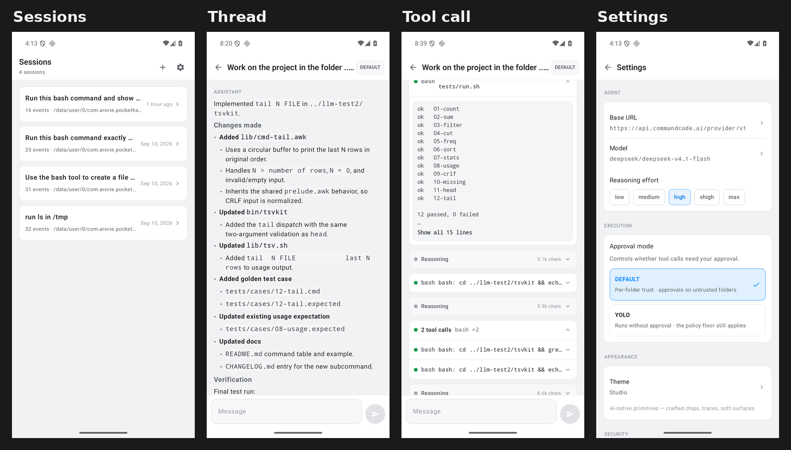
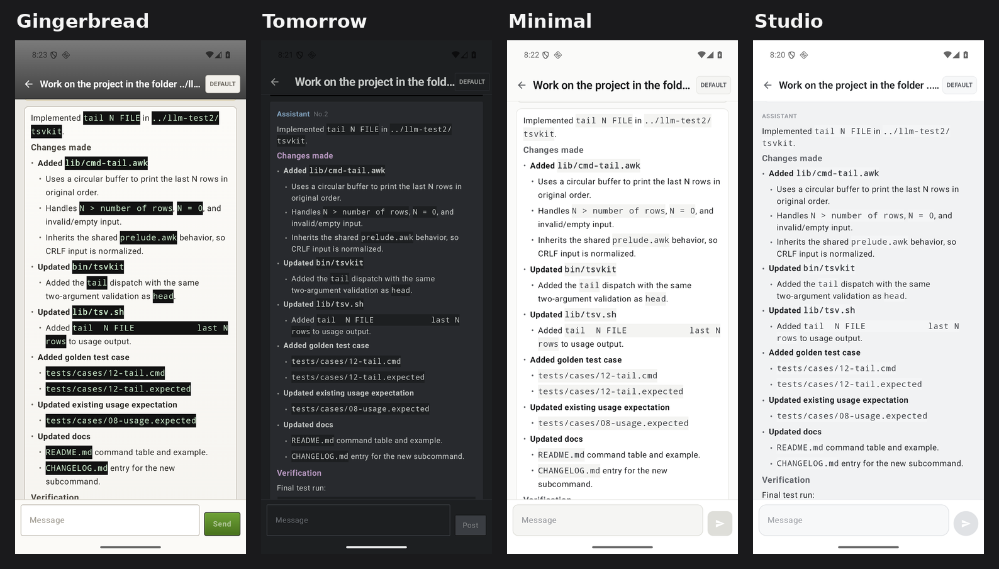

# PocketHarness

**A coding agent that runs on your phone.** It talks to any OpenAI-compatible endpoint, executes
real commands through a bundled GNU bash 5.3 on the app's own filesystem, and keeps every session
as a chat thread you can approve, steer, stop and resume.

Deliberately small: two tools, a one-sentence system prompt, a linear loop — and the session
transcript (an append-only JSONL) as the durable object.



## What it does

- **Real shell, real files.** `bash` and `str_replace_editor` run in a per-session workspace on the
  device. Output clips to a head/tail window and spills to file; exit codes, timeouts and failures
  are reported as failures.
- **Every command is visible — and gated.** The thread shows each call with its status; a
  per-folder trust gate asks before the first execution, `rm` maps to trash, and a policy floor
  outranks the mode switch. YOLO mode skips the gate when you would rather not be asked.
- **Sessions are threads.** Close the app and come back: the thread replays and the model keeps its
  context. Steer mid-turn; Stop ends the turn. Reasoning and tool calls stay collapsible, long
  output stays folded until you expand it.
- **Replies render markdown** — headings, lists, inline code and fenced code blocks, styled to the
  current look.
- **Four looks, one switch.** Gingerbread (2010-era chrome), Minimal, Tomorrow, Studio —
  Settings → Appearance, no rebuild. The default is Gingerbread, the original.



## Status

Working end to end on an emulator (API 36, x86_64/arm64) against a real provider. The honest edges:

- A turn does not reliably survive backgrounding; the foreground service is the open item.
- No token streaming: a turn appears when it completes, with a status line while it runs.

## Build and run

Needs JDK 17+ and an Android SDK with platform 36.

```bash
./gradlew :app:assembleDebug
adb install -r app/build/outputs/apk/debug/app-debug.apk
```

Open **Settings** and enter your endpoint's base URL, model id and API key. The key is stored in
the Android Keystore; nothing else keeps it.

## Licence

Harness code: MIT (see `LICENSE`).

`app/src/main/assets/userland/bash-*` is **GNU bash 5.3** (**GPL-3.0-or-later**) — upstream source
at `https://ftp.gnu.org/gnu/bash/`, build recipe in `scripts/build-bash-android.sh`.
